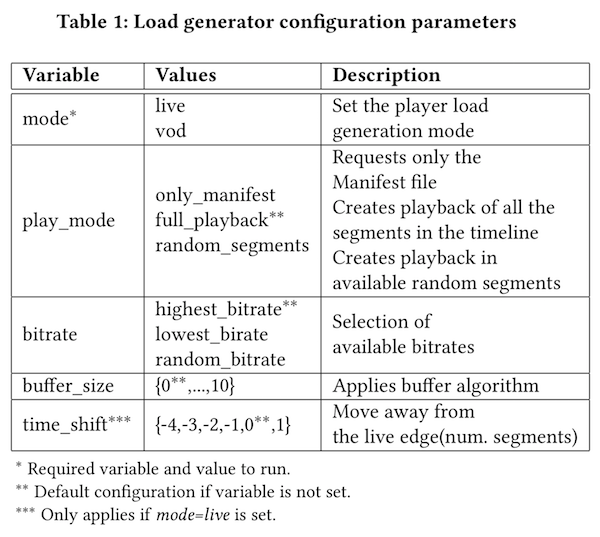

Streaming load testing
======================
Load generation tool for evaluation of MPEG-DASH and HLS video streaming
setups. This project is an extension of `Locust`_ open source software.
This extension is **NOT** a product/solution by Unified Streaming.

Docs: `MMSys2020 paper`_

.. _`MMSys2020 paper`: https://github.com/unifiedstreaming/streaming-load-testing/docs/MMSys2020-paper.pdf
.. _`Locust`: https://locust.io/

.. contents:: Table of Contents
  :local:
  :depth: 2

What is Locust
--------------

Locust is an open source tool for load testing of web applications. The
software is optimized to support the emulation of a large number of users,
without using a large number of threads by using an event-driven model. Locust
allows  writing specific user behaviour for load testing through plain Python
programming language scripts. 

How to use the tool
--------------------
The following figure presents the possible command-line parameter configuration
of the load testing tool.

+-----------------------------------------+
|                 |fig1|                  |
+-----------------------------------------+
|      Configuration parameters           |
+-----------------------------------------+

Use the tool in a hypervisor
^^^^^^^^^^^^^^^^^^^^^^^^^^^^
In case you need to run the Python scripts from a VM you will need to
clone the repository and install the Python requirements.txt by running the 
following commands.

.. code-block:: bash 

    #!/bin/bash
    git clone https://git.unified-streaming.com/research/streaming_load_testing
    cs streaming_load_testing
    make init

Load test example
"""""""""""""""""
.. code-block:: bash

    #!/bin/bash

    HOST_URL=https://demo.unified-streaming.com \
        MANIFEST_FILE=/video/ateam/ateam.ism/ateam.mpd \
        mode=vod \
        play_mode=full_playback \
        bitrate=lowest_bitrate \
        locust -f load_generator/locustfiles/vod_dash_hls_sequence.py \
        --no-web -c 1 -r 1 --run-time 10s --only-summary \
        --csv=test-results/output_example 

Use the tool through a Docker image
^^^^^^^^^^^^^^^^^^^^^^^^^^^^^^^^^^^

Create Docker image by building the Docker file provided.

.. code-block:: bash

    #!/bin/bash
    git clone https://git.unified-streaming.com/research/streaming_load_testing
    cd streaming_load_testing
    make build

Run a simple load testing example using the built docker image. The following
command will create a performance test and creates a folder with ``csv`` files 
results in the folder test-results.

Load test example
"""""""""""""""""
.. code-block:: bash 

    #!/bin/bash

    docker run  \
        -e "HOST_URL=https://demo.unified-streaming.com" \
        -e "MANIFEST_FILE=/video/ateam/ateam.ism/ateam.mpd" \
        -e "mode=vod" \
        -e "play_mode=full_playback" \
        -e "bitrate=lowest_bitrate" \
        -p 8089:8089 \
        -v ${PWD}/test-results/:/test-results/ \
        unified-streaming/load-generator \
        -f /load_generator/locustfiles/vod_dash_hls_sequence.py \
        --no-web -c 1 -r 1 --run-time 10s --only-summary \
        --csv=../test-results/output_example 

